# Docker + Deploying and Managing Containers with GCP Cloud Run and Azure Container Apps

## Link to Applications
1. GCP Cloud Run
    * https://flask-pkmn-md-site-1057035447975.us-central1.run.app
2. Azure 
    * https://flask-pkmn-md-site.greentree-09dfd09f.centralus.azurecontainerapps.io/

## 1. Containerize a Simple Application
1. Create docker repo
2. Create a flask app in VSC
    * NOTE: I copied over an old website I made from my [pkmn_md_site](https://github.com/dnce17/pkmn_md_site) repo
3. In VSC terminal, ran the following cmds based on [deployment_instructions.md](https://github.com/dnce17/HHA504_assignment_containers/blob/main/deployment_instructions.md):
    * docker login -u dnce17
    * docker build --platform linux/amd64 -t prac-docker:v1
    * docker run -p 5000:5000 prac-docker:v1
    * docker tag prac-docker:v1 dnce17/prac-docker:v1
    * docker push prac-docker:v1
4. The Docker image should now be in Docker
    
## 2. Deploy to GCP Cloud Run
### GCP Cloud Run
1. Go to Cloud Run
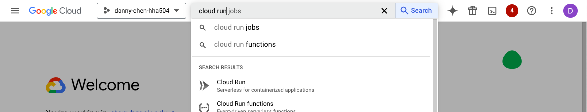
2. Deploy a service container
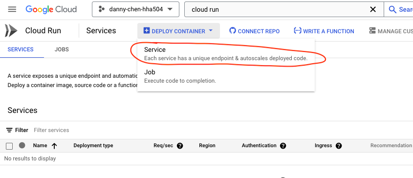
3. The following configs were used for my case
    * Artifact Registry + Docker Hub --> checked
    * Container image URL: docker.io/dnce17/prac-docker:v1
        * Format: docker.io/(docker_username)/(name_of_docker_repo):(version)
    * Authentication: Allow unauthenticated invocations
        * Allows anyone to enter
    * CPU allocation and pricing: CPU is only allocated during request processing
        * Means a potential 0 cost env; not going to cost anything if users do not request (go to) URL, but there are limits per month
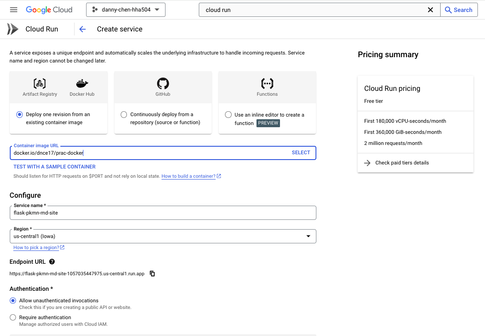

    * Container(s), Volumes, Networking, Security
        * Container port: 5000
            * The port should be the same across app.py and EXPOSE in Dockerfile or else issues will arise
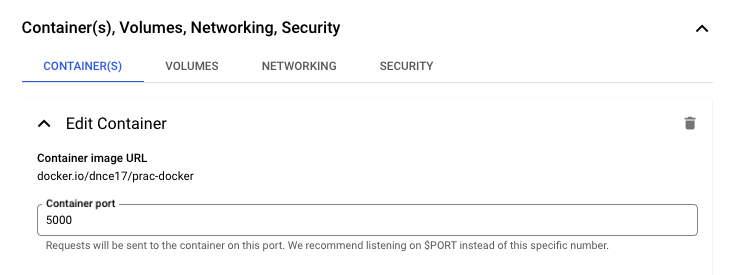
        * Revision scaling
            * Maximum number of instances: 3
                NOTE: This can be helpful if the app gets popular. Lowering the max instance prevents the site from getting overrun.   
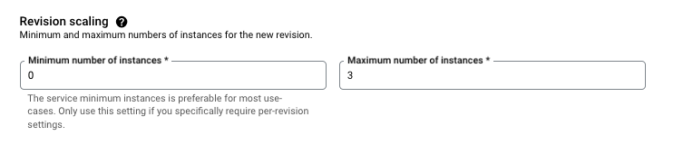
4. Create the container 
5. Click the link generated after creation is finished to see if the app is running correctly
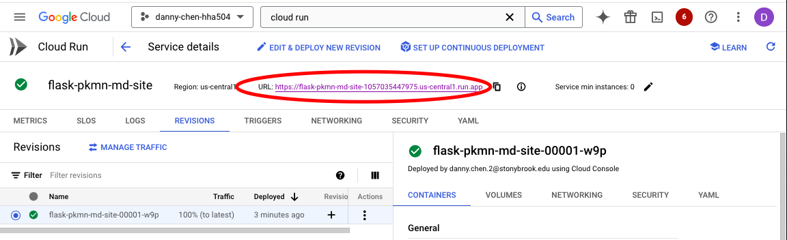

### GCP Extra: Updating the App
1. After making edits to app, rerun the following, but just change the version (if previous was v1, now do v2):
    1. docker build --platform linux/amd64 -t prac-docker:v2 .
    2. docker tag prac-docker:v2 dnce17/prac-docker:v2
    3. docker push dnce17/prac-docker:v2
2. In your GCP service container, click "Edit & Deploy New Revision"
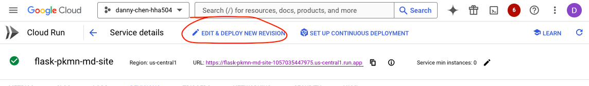
3. Change the container image URL to include the new version, then deploy
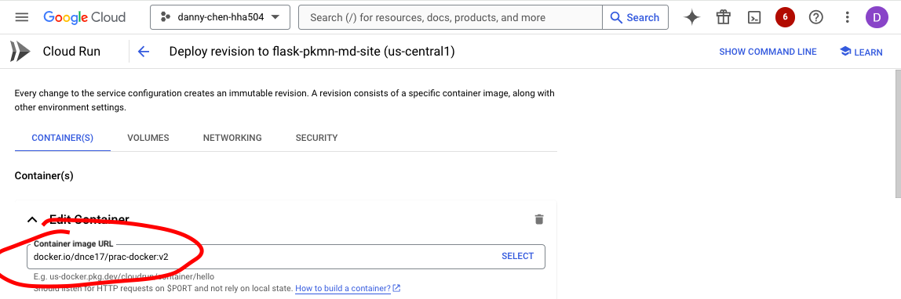
4. After deployment, click the URL again to see if everything is correct

## 3. Deploy to Azure Container Apps
1. Search and select "Container Apps" in the search results
2. Click "Create," then "Container App"
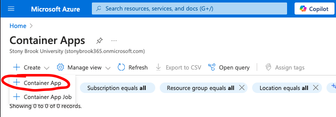
3. The below configs were used:
    * Basics tab
        * Container app name: flask-pkmn-md-site
            * Any app name can be used
        * Deployment source: Container image
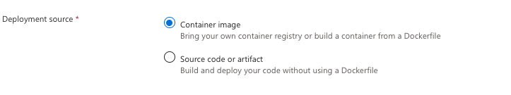
    * Container
        * Image source: Docker Hub or other registries
        * Image type: Public
        * Image and tag: dnce17/prac-docker:v2
            * "v2" b/c I had updated the files before
            * Format: (docker_username)/(name_of_docker_repo):(version)
        * Advanced settings
            * CPU and Memory: 0.25 CPU cores, 0.5 Gi memory
                * I chose the lowest one
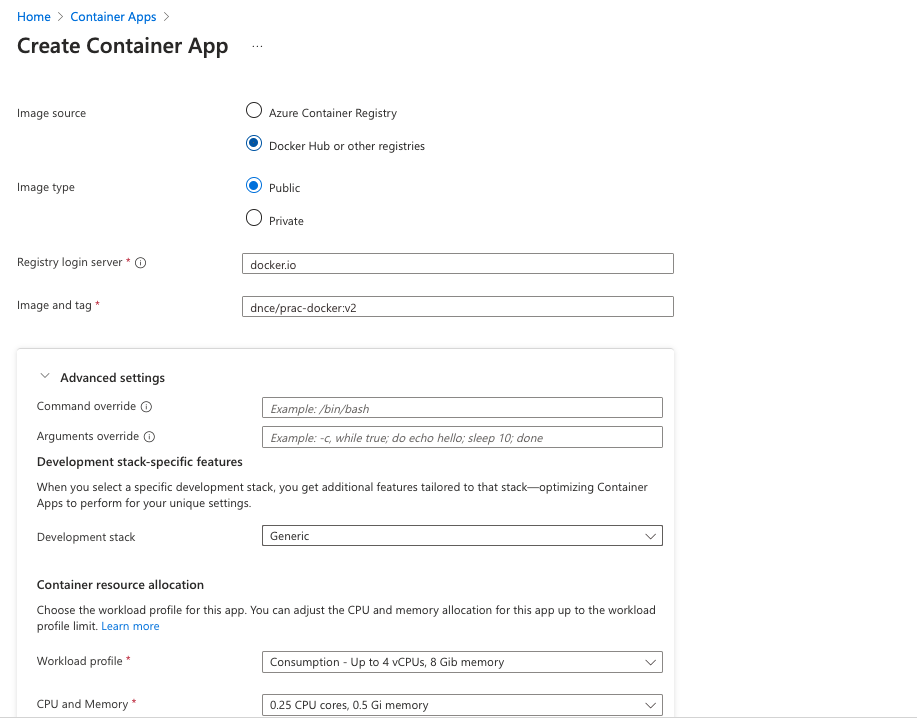
    * Ingress (**KEY step to ensure that an application URL is generated)
        * Ingress: Enabled
        * Ingress traffic: Accepting traffic from anywhere
        * Ingress type: HTTP
        * Target port: 5000
            * Make sure this is whatever the EXPOSE and app.py port is
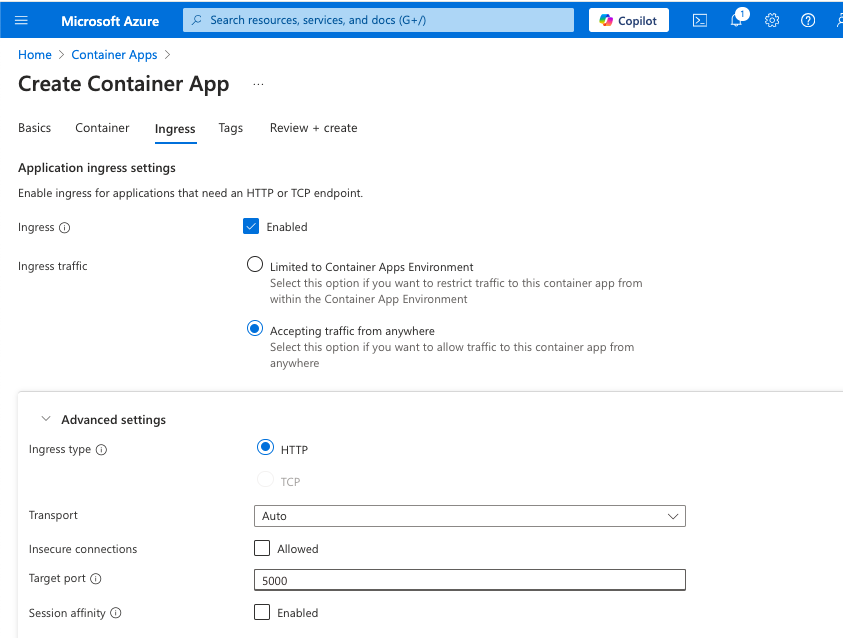
4. Create the app, then go to the resource after creation is complete
5. Click the link under the "Application URL" in the Overview page to check if deployment is successful
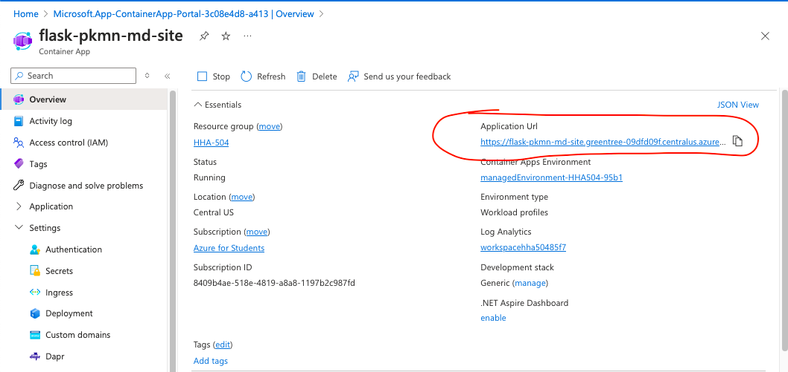
        

## Reflection
Since I created my Docker account with my GitHub account, I did not have a password to enter when I ran the "docker login -u dnce17" cmd. I was able to create a password for my Docker account by using the forget password link. 

Another challenge was the "docker build" cmd not working. I was getting the following error: "Cannot connect to the Docker daemon at unix:///var/run/docker.sock. Is the docker daemon running?" I could not find a solution on Google, so I used ChatGPT and found that I simply needed to open up Docker Desktop, which solved the issue. 

On the other hand, deploying the application on both GCP and Azure was smoother than I thought. There was not much configurations to set and no issues with both cloud platforms in creating the service container and deploying the application. Docker seems like a good way for students to showcase their work if they ever develop personal projects and want to deploy them. For example, since GCP offers the option to allocate CPU only during request processing and gives users a certain amount of free request per month, students could possibly pay no cost at all, assuming their application does not generate too much traffic.

## Credits
* Azure - https://tutorialsdojo.com/deploying-docker-images-to-azure-container-apps/
